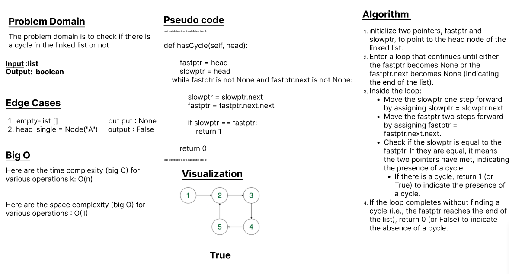
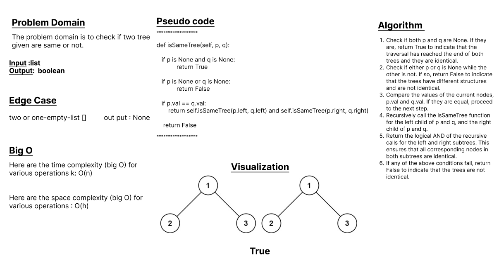

# DSA-Review

## Problem 1:
Write a function has_cycle to determine whether a linked list contains a cycle. A cycle in a linked list occurs when a node in the list can be reached again by continuously following the next pointer. The function should take in the head of the linked list as a parameter and return True if a cycle exists, and False otherwise. You may assume that the linked list is non-empty.

## Whiteboard Process

## Problem 2:
Write a function is_same_tree that takes the roots of two binary trees, p and q, as input and determines whether they are the same or not. Two binary trees are considered the same if they are structurally identical, meaning they have the same structure of nodes, and the corresponding nodes in both trees have the same values.

## Whiteboard Process

 

